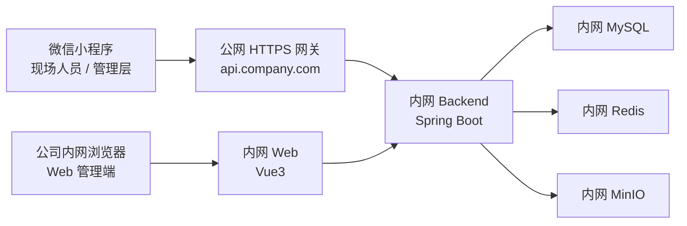

# Project Issue Hub 内网核心与小程序公网网关部署方案

## 1. 结论

这套系统可以做到：

- `Web 管理端` 仅在公司内网开放
- `后端核心服务 / MySQL / Redis / MinIO` 仅在公司内网开放
- `微信小程序` 通过一个受控的公网 `HTTPS` 网关访问系统
- 核心数据仍然保留在公司内网

这套方案的关键原则是：

`小程序不能直接访问纯内网服务，但可以访问一个公网可达的 HTTPS 网关；网关再转发到内网后端。`

## 2. 推荐架构



建议拆成两类访问入口：

- `Web 管理端`
  - 只允许公司内网访问
  - 例如：`https://pih-web.intra.company.com`
- `小程序 API 网关`
  - 对公网开放，但只开放必要接口
  - 例如：`https://pih-api.company.com`

## 3. 为什么不能让小程序直接访问纯内网

微信小程序有固定限制：

- 访问地址必须是微信后台配置过的合法域名
- 正式版必须是 `HTTPS`
- 手机必须能访问到这个域名

所以如果后端只在公司内网、手机完全访问不到，小程序就无法正常使用。

## 4. 最推荐的落地方式

推荐你采用下面这套：

### 4.1 内网区

- `opl-backend`
- `opl-mysql`
- `opl-redis`
- `opl-minio`
- `opl-web`

说明：

- `opl-web` 仅供公司内网员工在浏览器使用
- `opl-backend` 不直接对公网开放
- 数据库、缓存、对象存储都只保留在内网

### 4.2 边界区 / DMZ / 公网网关区

- 一台 Nginx 或企业 API Gateway
- 对公网开放一个 HTTPS 域名
- 仅反向代理小程序需要的接口

说明：

- 小程序只访问网关
- 网关通过白名单访问内网后端
- 不把 MySQL、Redis、MinIO 控制台、Web 后台暴露公网

## 5. 域名规划建议

建议至少准备两个域名：

### 5.1 小程序 API 域名

- `pih-api.company.com`

用途：

- 小程序登录
- 问题列表
- 问题详情
- 图片视频上传
- 评论 / 跟进
- 附件预览下载

### 5.2 内网 Web 域名

- `pih-web.intra.company.com`

用途：

- 项目经理、管理层、管理员登录 Web 后台

说明：

- 这个域名可以不暴露公网
- 只在公司内网 DNS 解析

## 6. 哪些接口应该开放给小程序

建议只开放以下业务接口到公网网关：

- `/api/auth/miniapp-login`
- `/api/auth/miniapp-bind`
- `/api/auth/change-password`
- `/api/projects/all`
- `/api/projects/{id}/issue-summary`
- `/api/issues`
- `/api/issues/{id}`
- `/api/issues/{id}/comments`
- `/api/issues/{id}/status`
- `/api/attachments/upload`
- `/api/attachments/{id}/content`
- `/api/dicts/options/*`

不建议对公网开放：

- `/swagger-ui.html`
- 管理员接口
- 用户管理接口
- 字典管理接口
- 项目团队管理接口
- Web 登录入口
- MinIO Console

## 7. 网络与防火墙建议

建议网络策略如下：

### 7.1 公网到网关

开放：

- `443`

关闭：

- 其余公网入站端口

### 7.2 网关到内网后端

仅允许：

- `网关服务器 -> 内网 backend 8081`

### 7.3 内网后端到数据服务

仅允许：

- `backend -> mysql 3306`
- `backend -> redis 6379`
- `backend -> minio 9000`

### 7.4 不应开放

- 公网 -> MySQL
- 公网 -> Redis
- 公网 -> MinIO Console
- 公网 -> Web 管理端

## 8. 附件上传与预览建议

你这个系统有图片和视频，附件策略建议这样做：

### 方案 A：最稳

- 小程序上传文件到后端接口 `/api/attachments/upload`
- 后端再写入内网 MinIO
- 小程序预览时通过 `/api/attachments/{id}/content` 获取

优点：

- 权限统一
- 审计清楚
- MinIO 不需要直接暴露公网

当前项目已经基本按这条链路实现，所以这是最适合你的方案。

## 9. 真机 / 正式发布前必须完成的配置

### 9.1 后端环境变量

正式环境 `.env` 建议至少配置：

```env
BACKEND_HOST_PORT=8081
WEB_HOST_PORT=8088

MINIO_PUBLIC_ENDPOINT=https://pih-api.company.com
REPORT_PUBLIC_BASE_URL=https://pih-web.intra.company.com

WECHAT_MINIAPP_MOCK_ENABLED=false
WECHAT_MINIAPP_APP_ID=你的小程序AppID
WECHAT_MINIAPP_SECRET=你的小程序Secret
```

### 9.2 小程序后台合法域名

在微信公众平台配置：

- `request` 合法域名：`https://pih-api.company.com`
- `uploadFile` 合法域名：`https://pih-api.company.com`
- `downloadFile` 合法域名：`https://pih-api.company.com`

## 10. 推荐部署步骤

### 第 1 步：部署内网核心系统

在内网服务器上部署：

- MySQL
- Redis
- MinIO
- Backend
- Web

并确认：

- `Web` 内网可访问
- `Backend` 内网可访问
- 数据读写正常

### 第 2 步：部署公网网关

在 DMZ 或边界服务器部署 Nginx：

- 对外只开放 `443`
- 配置小程序域名证书
- 反代到内网 backend

### 第 3 步：联调真机

验证：

- 小程序登录
- 项目选择
- 问题创建
- 图片上传
- 视频上传
- 问题详情
- 评论跟进
- 附件预览

### 第 4 步：提交微信审核并发布

## 11. Nginx 网关样例

可直接参考：

- [C:\Users\Administrator\Projects\WeCHAT-OPL-platform\docs\ops\nginx-miniapp-public-gateway.conf](C:\Users\Administrator\Projects\WeCHAT-OPL-platform\docs\ops\nginx-miniapp-public-gateway.conf)

这个样例的思路是：

- `pih-api.company.com`
- 只代理 `/api/`
- 限制请求体大小
- 保留真实 IP
- 强制 HTTPS

## 12. 风险与建议

### 12.1 不建议的做法

- 让小程序直连纯内网服务
- 把整个 Web 后台开放到公网
- 把 MinIO Console 暴露到公网
- 把数据库端口开放公网

### 12.2 建议的管理策略

- Web 后台仅内网访问
- 小程序只通过公网网关访问 API
- 对公网网关加限流、审计、WAF 或白名单能力
- 管理员账号强制修改初始密码
- 定期备份 MySQL 与 MinIO

## 13. 你这套系统最适合的最终形态

一句话总结：

`数据和后台留在内网，小程序通过一层最小公网网关接入。`

这既满足：

- 公司不想把核心系统暴露公网
- 小程序又必须能在外网手机上访问

也兼顾了：

- 安全
- 可维护性
- 真正可落地
